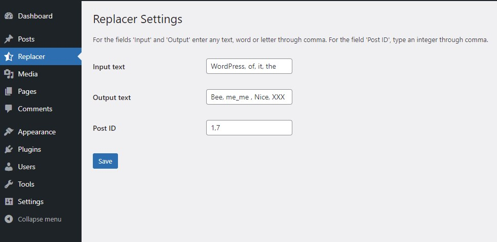
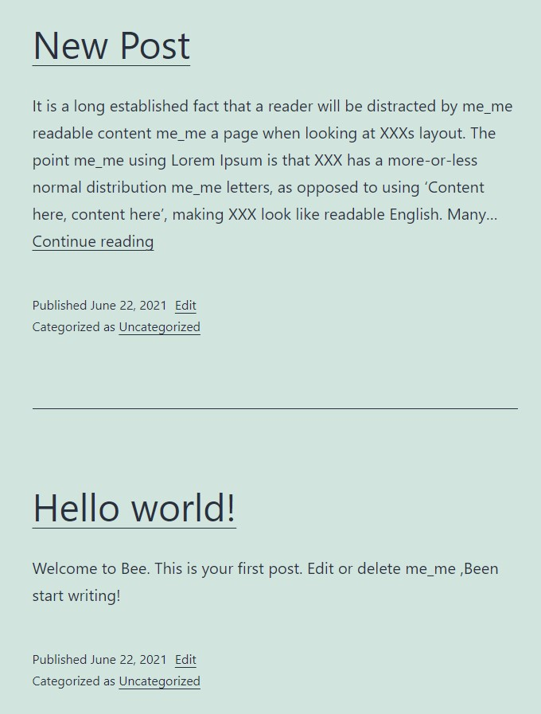

# IK REPLACER 
#### IK Replacer - test plugin to replace text with a random value  in the content for а post by id.
1. For Searching('Input Text') on the text in the content of the post - enter any text, word or letter through comma.
2. For Replacing('Output Text') the text with random 'output list' - enter any text, word or letter through comma. 
3. To set Post List('Post ID') - type an integer(post_id) through comma.

-- Replacer Settings after activation ---

-- Results ---

